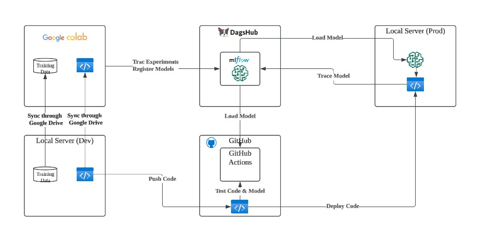

# Overview
A sandbox for MLOps env:
- **Local server**: used for both development and production
- **Google Colab**: used for model training & experiment
- **MLflow**: used for managing models, loging experiments and tracing models.
- **DagsHub**: used to serve MLflow.
- **GitHub**: used to manage code versioninig.
- **GitHub Actions**: used for testing code and model.

# Reference
- [DAGsHub-Official/dagshub-docs | DagsHub | MLflow Tracking](https://dagshub.com/DagsHub-Official/dagshub-docs/src/main/docs/integration_guide/mlflow_tracking.md)